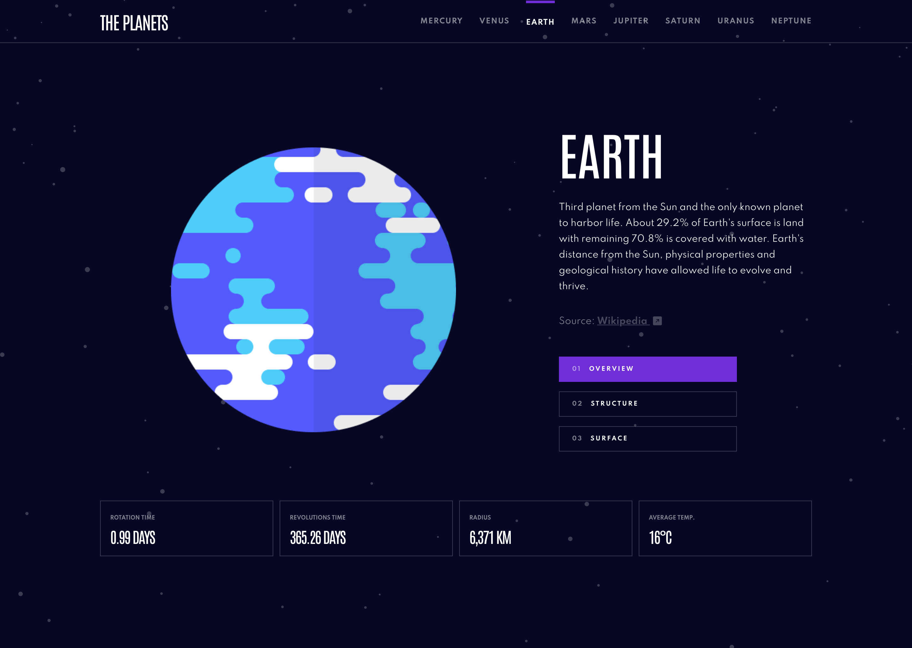

# Frontend Mentor - Planets fact site solution

This is a solution to the [Planets fact site challenge on Frontend Mentor](https://www.frontendmentor.io/challenges/planets-fact-site-gazqN8w_f). Frontend Mentor challenges help you improve your coding skills by building realistic projects.

## Table of contents

- [Overview](#overview)
  - [The challenge](#the-challenge)
  - [Screenshot](#screenshot)
  - [Links](#links)
- [My process](#my-process)
  - [Built with](#built-with)
  - [What I learned](#what-i-learned)
  - [Continued development](#continued-development)
  - [Useful resources](#useful-resources)
- [Author](#author)
- [Project Setup](#project-setup)

## Overview

### The challenge

Users should be able to:

- View the optimal layout for the app depending on their device's screen size
- See hover states for all interactive elements on the page
- View each planet page and toggle between "Overview", "Internal Structure", and "Surface Geology"

### Screenshot



### Links

- Solution URL: [Solution on frontendmentor.io](https://your-live-site-url.com)
- Live Site URL: [Live Site](https://planet-facts-jls.netlify.app/)

## My process

### Built with

- [Vue.js](https://vuejs.org/) - JS library
- SCSS - CSS Preprocessor
- Flexbox
- Mobile-first workflow
- Bootstrap 5 - CSS Framework

### What I learned

I got some really useful new knowledge about Vue.js and how to build applications with it.

### Continued development

I will definitely dive a lot deeper into Vue.js and want to build more applications with it.

### Useful resources

- [Vue.js Docs](https://vuejs.org/guide/) - The official Docs from Vue.js are really helpful and provide some great content!

## Author

- Website - [Jan-Luca Splettstößer - Personal Website](https://www.spletti.info)
- Frontend Mentor - [@lucaspl3tti](https://www.frontendmentor.io/profile/lucaspl3tti)
- Github - [@lucaspl3tti](https://github.com/lucaspl3tti)

## Project setup

### Recommended IDE Setup

[VSCode](https://code.visualstudio.com/) + [Volar](https://marketplace.visualstudio.com/items?itemName=johnsoncodehk.volar) (and disable Vetur) + [TypeScript Vue Plugin (Volar)](https://marketplace.visualstudio.com/items?itemName=johnsoncodehk.vscode-typescript-vue-plugin).

### Commands

```sh
npm install
```

### Compile and Hot-Reload for Development

```sh
npm run dev
```

### Compile and Minify for Production

```sh
npm run build
```

### Lint with [ESLint](https://eslint.org/)

```sh
npm run lint
```
